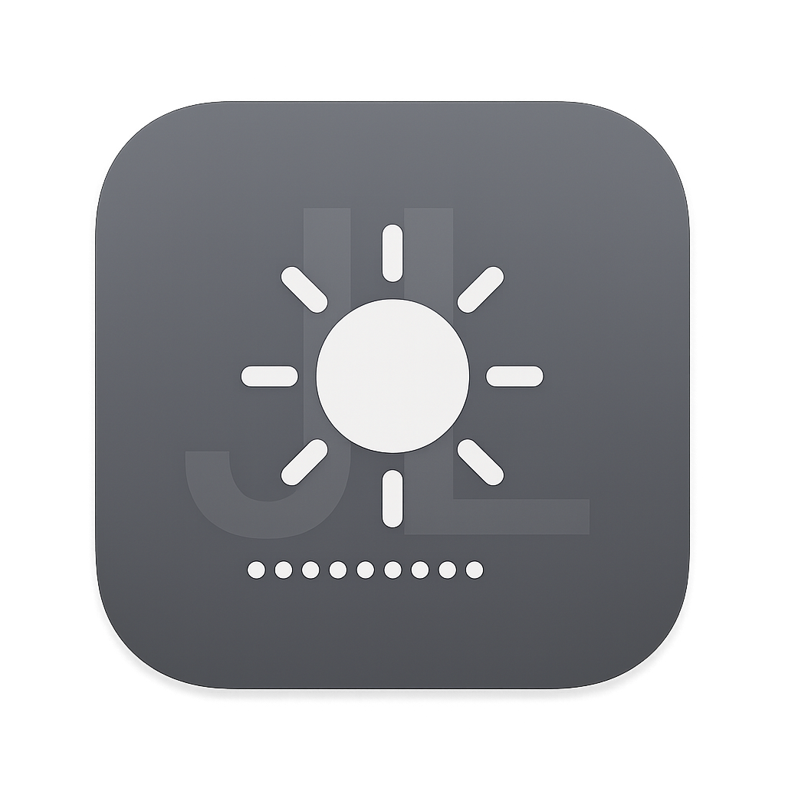
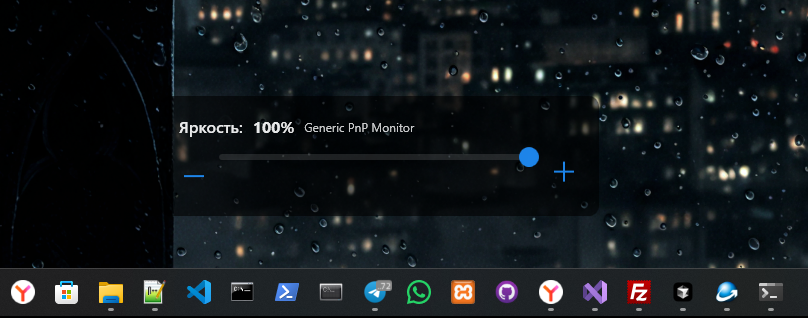
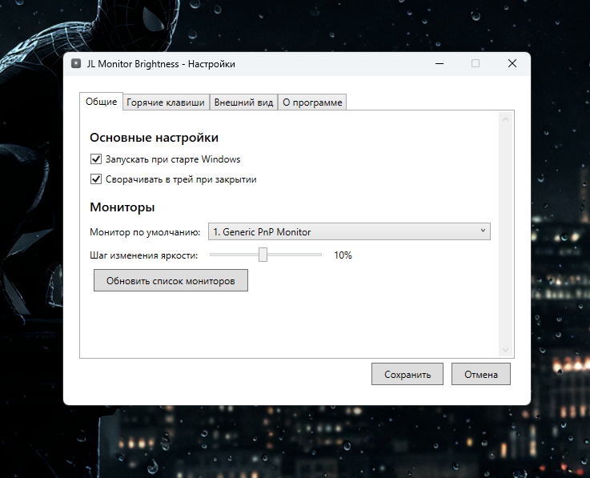
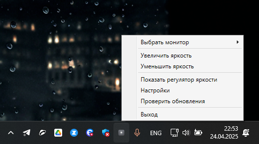

# JL Monitor Brightness

Утилита для удобной регулировки яркости внешних мониторов на Windows с помощью горячих клавиш и наглядного интерфейса, похожего на аналогичные функции в мобильных устройствах.

## Возможности

- ✨ Регулировка яркости внешних мониторов через горячие клавиши
- 🎮 Интуитивно понятный интерфейс в стиле мобильных устройств
- 🖥️ Поддержка нескольких мониторов с возможностью выбора
- 💻 Работа в системном трее с удобным контекстным меню
- 🔄 Автоматическая проверка обновлений
- 🚀 Портативная версия без необходимости установки

## Скриншоты

*Регулятор яркости, появляющийся при нажатии горячих клавиш*

*Окно настроек программы*

*Контекстное меню в системном трее*

## Системные требования

- Windows 10 или новее
- .NET 6.0 Runtime (входит в портативную версию)
- Монитор с поддержкой DDC/CI

## Установка

### Вариант 1: Установщик

1. Скачайте [установщик](https://github.com/John-LapTev/JL-Monitor-Brightness/releases/download/v1.0.0/JL_MonitorBrightness_1.0.0_Setup.exe)
2. Запустите скачанный файл и следуйте инструкциям установщика
3. После установки программа будет доступна в меню «Пуск» и на рабочем столе (если выбрана соответствующая опция)

### Вариант 2: Портативная версия

1. Скачайте [портативную версию](https://github.com/John-LapTev/JL-Monitor-Brightness/releases/download/v1.0.0/JL_MonitorBrightness_1.0.0_Portable.exe)
2. Распакуйте архив в любую папку
3. Запустите `JL_MonitorBrightness_Portable.exe`
4. Настройки будут сохраняться в той же папке, что удобно для использования на USB-накопителе

## Использование

### Горячие клавиши по умолчанию

- `Ctrl + Alt + ↑` - увеличить яркость
- `Ctrl + Alt + ↓` - уменьшить яркость
- `Ctrl + Alt + Home` - показать регулятор яркости

### Контекстное меню системного трея

Щелкните правой кнопкой мыши по иконке в системном трее, чтобы открыть меню:
- Выбрать монитор - выбор монитора для управления
- Увеличить яркость - увеличить яркость текущего монитора
- Уменьшить яркость - уменьшить яркость текущего монитора
- Показать регулятор яркости - отобразить визуальный регулятор
- Настройки - открыть окно настроек
- Проверить обновления - проверить наличие новых версий
- Выход - закрыть программу

Двойной щелчок по иконке в трее показывает регулятор яркости.

## Настройка

Во вкладке "Настройки" вы можете:
- Изменить шаг изменения яркости
- Настроить горячие клавиши
- Настроить внешний вид регулятора (прозрачность, время отображения, цвет)
- Включить/отключить автозапуск при старте Windows
- Включить/отключить автоматическую проверку обновлений

## Устранение неполадок

### Яркость не регулируется

Убедитесь, что:
- Монитор поддерживает стандарт DDC/CI
- В меню монитора включена поддержка DDC/CI
- Вы выбрали правильный монитор в настройках программы
- Программа запущена с правами администратора (если требуется)

### Горячие клавиши не работают

- Проверьте, не конфликтуют ли выбранные комбинации с другими программами
- Попробуйте назначить другие комбинации клавиш в настройках

## Обратная связь и поддержка

Если у вас есть вопросы, предложения или вы нашли ошибку:
- [Создайте Issue](https://github.com/John-LapTev/JL-Monitor-Brightness/issues/new)
- [Свяжитесь с автором](https://jl-studio.art/contact)

## Лицензия

Этот проект распространяется под лицензией MIT. Подробности в файле [LICENSE](LICENSE).

---
© 2025 JL Studio. Все права защищены.
