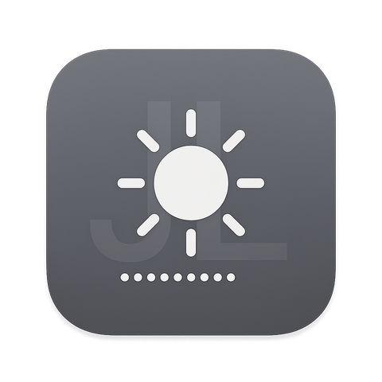

# JL Monitor Brightness



Яркость внешних мониторов с клавиатуры. Небольшая утилита для Windows: живёт в трее,
по горячей клавише показывает регулятор и меняет яркость через DDC/CI — тот же канал,
которым пользуется экранное меню самого монитора.

**Горячие клавиши здесь бесплатны.** У ближайшего аналога (Monitorian) они и
командная строка вынесены в платную подписку.

## Возможности

- Регулировка яркости внешних мониторов горячими клавишами
- Регулятор поверх экрана: слайдер, колесо мыши, крупный процент
- Несколько мониторов: выбор в трее, переключение на лету
- Работа из трея, окно настроек открывается только когда нужно
- Запуск вместе с Windows сразу в свёрнутом виде
- Проверка обновлений
- Портативная версия — настройки лежат рядом с программой

## Запуск

| Способ | Что делает |
|:---|:---|
| `JL-Monitor-Brightness.exe` | обычный запуск |
| `JL-Monitor-Brightness.exe /minimized` | **сразу в трей, без окна настроек** |

Ключ `-minimized` работает так же.

**Для автозапуска через планировщик задач** укажите `/minimized` в поле
«Добавить аргументы» на вкладке «Действия» — иначе при входе в систему поверх
работы откроется окно настроек.

Галочка «Запускать вместе с Windows» в настройках прописывает этот ключ сама.

## Горячие клавиши по умолчанию

| Комбинация | Действие |
|:---|:---|
| `Ctrl + Alt + ↑` | ярче |
| `Ctrl + Alt + ↓` | темнее |
| `Ctrl + Alt + Home` | показать регулятор |

Меняются в настройках. Комбинации с `Alt` поддерживаются.

⚠️ Горячие клавиши не сработают, когда в фокусе окно, запущенное от имени
администратора, а сама программа — нет. Это ограничение Windows, не программы.

## Где лежат настройки

`settings.xml` рядом с программой, если папка доступна на запись — так работает
портативная версия, включая запуск с флешки.

Если папка защищена от записи (обычная установка в `Program Files`), настройки
уходят в `%APPDATA%\JL-Monitor-Brightness\settings.xml`.

Сбросить настройки — удалить этот файл.

## Системные требования

- Windows 10 или новее
- .NET 8 Runtime — [скачать](https://dotnet.microsoft.com/download/dotnet/8.0/runtime)
  (портативная версия тоже требует установленный runtime)
- **Внешний монитор с поддержкой DDC/CI**

## ⚠️ Что не поддерживается

**Встроенный экран ноутбука.** Матрица ноутбука управляется не через DDC/CI, а через
WMI — этого в программе пока нет. На чистом ноутбуке без внешнего монитора программа
скажет «мониторы не найдены».

Также не работает по беспроводному подключению (Miracast) — DDC/CI там не передаётся
в принципе.

## Монитор не определяется

Причины по убыванию частоты:

1. **DDC/CI выключен в экранном меню монитора.** Обычно пункт лежит в разделе
   «Others» / «Setup» / «Управление». Включить и перезапустить программу.
2. **Игровой или эко-пресет монитора** блокирует DDC/CI. Переключиться на обычный режим.
3. **Переходник, USB-хаб или док-станция** часто срезают DDC/CI. Попробовать прямое
   подключение к видеокарте.
4. **Кабель и порт.** Иногда помогает переключение HDMI ↔ DisplayPort.
5. **Драйверы видеокарты**, у AMD встречаются известные проблемы.
6. **NVIDIA Surround и AMD Eyefinity несовместимы с DDC/CI** — при объединении
   мониторов в один рабочий стол управление яркостью недоступно.
7. Монитор просто не умеет DDC/CI — встречается у бюджетных моделей.

**Как понять, что дело не в программе:** проверьте монитор через
[ControlMyMonitor](https://www.nirsoft.net/utils/control_my_monitor.html) (NirSoft) или
[Monitorian](https://github.com/emoacht/Monitorian). Если яркость не меняется и там —
причина в мониторе, кабеле или драйвере.

## Сборка из исходников

```bash
git clone https://github.com/John-LapTev/JL-Monitor-Brightness.git
cd JL-Monitor-Brightness
dotnet build -c Release
```

Нужен [.NET 8 SDK](https://dotnet.microsoft.com/download/dotnet/8.0). Проект собирается
только под Windows — WPF на других системах не строится.

**Портативная версия одним файлом:**

```bash
dotnet publish -c Release -r win-x64 --self-contained false ^
  -p:PublishSingleFile=true -p:IncludeNativeLibrariesForSelfExtract=true ^
  -o publish/portable
```

**Установщик** (нужен [Inno Setup 6](https://jrsoftware.org/isdl.php)):

```bash
"C:\Program Files (x86)\Inno Setup 6\ISCC.exe" JL-Monitor-Brightness.iss
```

Готовые сборки собираются автоматически через GitHub Actions при создании тега `v*`.

## Чем отличается от Twinkle Tray и Monitorian

| | Twinkle Tray | Monitorian | JL Monitor Brightness |
|:---|:---:|:---:|:---:|
| Горячие клавиши | ✅ | 💰 платно | ✅ |
| Русский интерфейс | машинный перевод | машинный перевод | ✅ родной |
| Слайдер на каждый монитор во флайауте | ✅ | ✅ | планируется |
| Экран ноутбука | ✅ | ✅ | планируется |
| Синхронизация мониторов | ✅ | ✅ | планируется |
| Командная строка | ✅ | 💰 платно | планируется |

Честно: по количеству возможностей мы пока позади. Сильные стороны — бесплатные
горячие клавиши, родной русский язык и небольшой размер.

## Лицензия

MIT — см. [LICENSE](LICENSE).

## Автор

[John-LapTev](https://github.com/John-LapTev)
